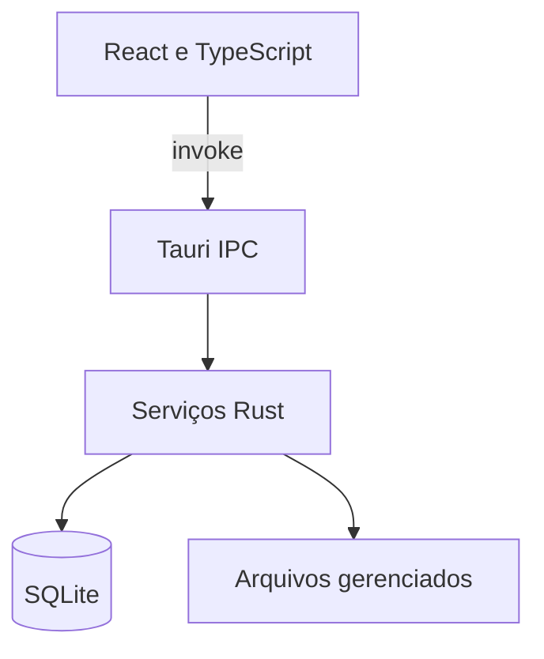

# Arquitetura

O MeliponarioManager é uma aplicação desktop local-first. React e TypeScript implementam a interface; Tauri expõe a ponte IPC; Rust concentra regras de domínio, transações e acesso a dados; SQLite e o diretório local da aplicação mantêm o estado persistente.

## Visão geral

A interface não acessa o SQLite nem o sistema de arquivos diretamente. Operações persistentes atravessam comandos Tauri e são validadas pelo backend.

## Camadas

### Interface

O diretório `src/` contém:

- `pages/`: telas e fluxos funcionais;
- `components/`: shell, navegação, dialogs, fichas e componentes compartilhados;
- `lib/`: clientes IPC, tipos de fluxos, navegação e apresentação;
- `hooks/`: carregamento do estado principal e coordenação de mutações;
- arquivos `*-types.ts` e `types.ts`: contratos usados pela interface;
- folhas de estilo globais e temáticas.

`WorkspaceRouter` seleciona a tela ativa. O contexto de meliponário é aplicado pela composição da interface e, nos serviços que oferecem esse contrato, também pelas consultas específicas do backend.

### Fronteira Tauri

`src-tauri/src/lib.rs` inicializa a aplicação, registra plugins, prepara o diretório de dados, aplica uma restauração pendente, abre o banco, executa migrations, reconcilia a Agenda e publica os comandos IPC.

Plugins oficiais usados no desktop:

- `tauri-plugin-dialog`: seleção e gravação de arquivos;
- `tauri-plugin-opener`: abertura e revelação de arquivos;
- `tauri-plugin-window-state`: persistência do estado da janela.

### Backend Rust

Os módulos em `src-tauri/src/` se dividem por responsabilidade:

- domínio e persistência: `domain`, `repository`, `database`, `time`;
- manejo: `inspections`, `feeding`, `production`, `maintenance`, `divisions`;
- rastreabilidade: `movements`, `transport`, `documents`, `lifecycle`, `history`, `timeline`;
- operação: `agenda*`, `alerts`, `dashboard`, `record_centers`, `reports`;
- administração e auditoria: `admin_commands`, `audit`, `record_corrections`, `record_states`, `reversals`;
- dados e arquivos: `data_management`, `managed_files`, `media`, `attachments`, `photo_preview`, `species_import`.

Comandos Tauri devem permanecer finos: recebem dados, delegam ao serviço responsável e retornam um resultado público. Regras críticas pertencem ao backend e, quando possível, recebem uma segunda defesa por constraints, índices ou triggers do SQLite.

## Inicialização

Na abertura do aplicativo:

1. o diretório de dados da aplicação é criado;
2. uma restauração previamente validada é aplicada, se existir;
3. as árvores gerenciadas de fotos e anexos são garantidas;
4. `meliponario.db` é aberto com chaves estrangeiras habilitadas;
5. as migrations pendentes são executadas pelo SQLx;
6. a Agenda reconcilia tarefas derivadas de registros `next_*`;
7. o pool SQLite é registrado no estado global do Tauri;
8. a interface passa a consumir os comandos IPC.

Uma falha nessa sequência impede que a aplicação opere sobre um estado parcialmente inicializado.

## Persistência

### SQLite

As migrations ficam em `migrations/` e formam um histórico cumulativo e imutável. Uma instalação nova executa toda a sequência; uma instalação existente executa somente migrations ainda não registradas em `_sqlx_migrations`.

Regras para alterações de schema:

- não edite uma migration já integrada ou distribuída;
- crie a próxima migration numerada;
- prefira mudanças aditivas e compatíveis com bancos existentes;
- preserve chaves estrangeiras e invariantes históricas;
- adicione teste de migration e de upgrade quando a mudança afetar dados existentes.

### Arquivos locais

O SQLite guarda vínculos e metadados. Fotos e anexos ficam sob `media/`, com caminhos relativos e nomes internos controlados pela aplicação. Backup e restauração tratam banco e mídia como um conjunto.

Detalhes: [Gerenciamento de dados](DATA-MANAGEMENT.md) e [Arquivos gerenciados](FILES.md).

## Estado factual e projeções

Entidades e fatos persistidos são a fonte de verdade. Timeline, alertas, Dashboard, Agenda derivada, fichas operacionais e relatórios são projeções calculadas a partir desses registros.

Uma projeção não deve criar estado paralelo para representar a mesma informação. Quando um cálculo precisar ser persistido por desempenho, o contrato de invalidação e reconciliação deve ser explícito.

## Transações e auditoria

Operações que afetam mais de um registro relacionado devem ser atômicas. Isso inclui troca de caixa, divisão com criação de descendente, movimentações, transições de ciclo de vida, execução especializada da Agenda e aplicação de restauração.

Correções, anulações e reversões preservam o registro original e o motivo administrativo. Exclusão física é restrita a cadastros sem uso histórico.

## Erros e segurança

- erros internos são convertidos em mensagens públicas antes de chegar à interface;
- paths absolutos, travessia com `..` e escapes da área gerenciada são rejeitados;
- arquivos escolhidos pelo usuário não são executados por comandos de shell construídos pela aplicação;
- a WebView usa Content Security Policy e `X-Content-Type-Options: nosniff`;
- importações, backup e restauração validam formato e integridade antes de alterar o estado ativo.

Consulte [SECURITY.md](../SECURITY.md) para relato de vulnerabilidades.

## Estrutura do repositório

| Caminho | Responsabilidade |
| --- | --- |
| `src/` | Interface React/TypeScript |
| `src-tauri/src/` | Backend Rust e comandos Tauri |
| `migrations/` | Evolução imutável do schema SQLite |
| `tests/` | Testes estruturais e de comportamento da interface |
| `scripts/` | Validações auxiliares de versão e bundles |
| `assets/` | Fontes de recursos visuais, incluindo o ícone oficial |
| `docs/` | Documentação técnica, operacional e histórica |
| `.github/` | CI, distribuição, templates e Dependabot |

## Decisões relacionadas

- [Modelo de domínio](DOMAIN.md)
- [Agenda operacional](AGENDA.md)
- [Transporte temporário](TRANSPORT.md)
- [Interface desktop](UI.md)
- [Distribuição desktop](DISTRIBUTION.md)
